# Phase 8.3 — Comprehensive Visual Sweep & Final Verification

**Release gate for the Phase 5–7 redesign.** This is the artifact for Hello's
final sign-off. Every claim below is backed by a live DOM/layout assertion in
`frontend/tests/visual-sweep/phase-8-3-*.spec.ts`; the screenshots are evidence
for a human reader, not a pixel baseline.

- **Verified:** 2026-09-03, against the local dev stack (Vite dev server,
  backend on :4000, seeded Postgres).
- **Viewport:** 1280 × 900, desktop only. Responsive/mobile treatment stays
  deferred past Phase 8 (recorded on `ServerFormSheet`: *"Desktop only for now
  — responsive/mobile treatment is deferred past Phase 8"*). 1280 is the width
  every other desktop sweep in this directory already uses.
- **Method:** no committed baseline screenshots and no pixel-diffing. Bounding
  rects, computed styles, WCAG contrast ratios and zero-overflow checks, run
  against the real app with real seeded data.

---

## How to reproduce

```
docker compose up -d db          # repo root
npm run dev                      # backend/  → :4000
npm run dev                      # frontend/ → :5173
cd frontend && npx playwright test tests/visual-sweep/phase-8-3-*.spec.ts
```

Screenshots land in `frontend/playwright-screenshots/phase-8-3/` (gitignored —
regenerate rather than diff). The curated subset below is committed under
`docs/screenshots/phase-8-3/`.

---

## Coverage

| # | Scope group | Spec | Tests |
|---|---|---|---|
| 1 | Dashboard Overview — 6 KPI cards (hover + click-through), Urgent Action Items (overdue / due-today / empty), Activity Timeline | `phase-8-3-dashboard.spec.ts` | 13 |
| 2 | Global shell & navigation — sidebar, Topbar, ⌘K palette (open / type / navigate / close / no-results) | `phase-8-3-shell-nav.spec.ts` | 6 |
| 3 | All 3 Sheet forms — ServerFormSheet (12 fields), ScheduleFormSheet (create + edit + ConflictState), ResourceEditorSheet (create + new-version + duplicate-confirm), each with validation errors | `phase-8-3-sheets.spec.ts` | 12 |
| 4 | Data tables & status badges — 6 list pages: card wrapper elevation, tabular-nums, row-action idle dim, deleted-row treatment; Schedule's 4 status colours | `phase-8-3-tables-badges.spec.ts` | 21 |
| 5 | Detail pages — Project / Environment / Server, view **and** edit mode, `<h1>` hierarchy + panel treatment | `phase-8-3-detail-pages.spec.ts` | 10 |
| | | **Total** | **62** |

Shared assertion vocabulary lives in `phase-8-3-helpers.ts` (overflow, contrast,
panel surface, table wrapper, tabular-nums).

**Visual-sweep suite: 67 tests / 10 files → 129 tests / 15 files.**
Vitest is untouched at **736 passing / 71 files** — this ticket adds no `src/`
changes.

---

## Highlighted surfaces

### Dashboard Overview

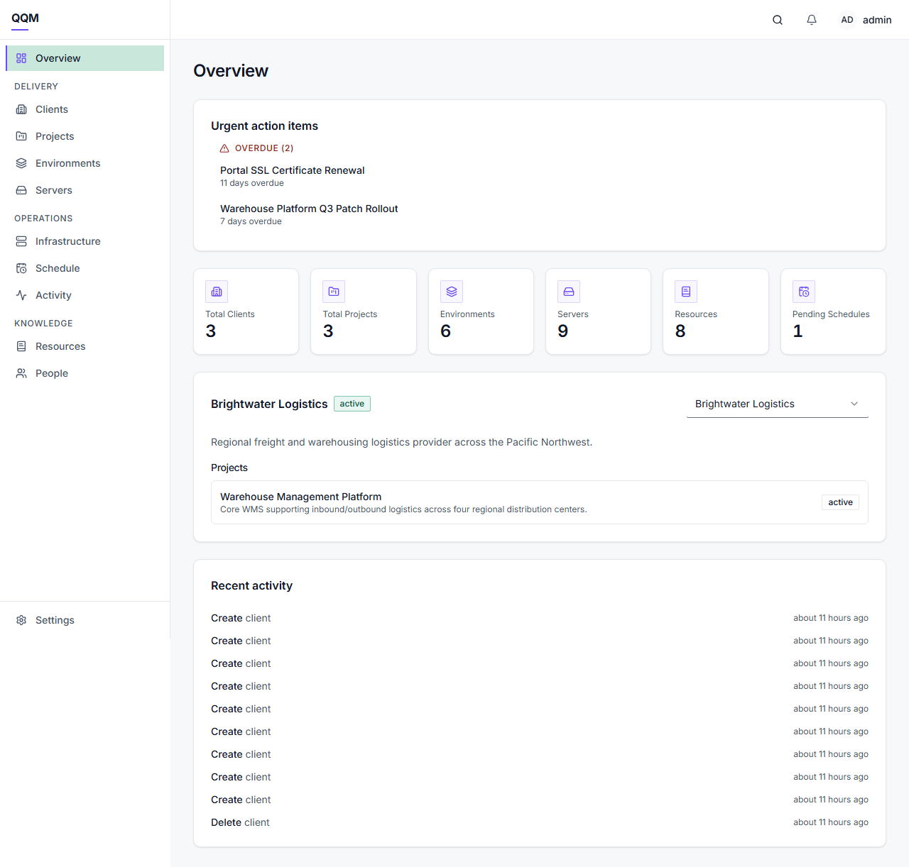

All six KPI tiles resolve to real counts on one row at 1280px (six equal grid
tracks, identical `y`), never a loading `…` or an error `—` masquerading as a
value. Hover lifts the tile, steps `shadow-elev-1 → shadow-elev-2` and tints the
border toward brand — and reverses cleanly when the pointer leaves. Each tile is
a real `<button>`, so it is keyboard-operable; all six click through, and
*Pending Schedules* carries its filter (`/schedule?status=pending`).

**Urgent Action Items — overdue (real seeded data):**

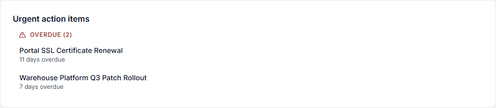

**Urgent Action Items — empty:**

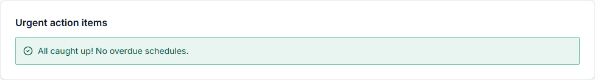

Overdue heading 8.66:1, due-today 8.14:1, empty-state callout 8.01:1 — all well
clear of AA. The due-today and empty states are driven by intercepting the box's
own query (the only `/api/schedules` call carrying a `to=` bound), so the
Pending Schedules KPI is never disturbed.

The Activity Timeline caps at 10 rows inside an elevated card, action on the
left and relative timestamp hard right on one line, with no overflow.

### Global shell & ⌘K palette

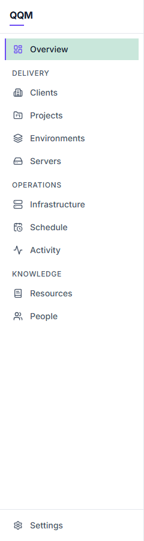

Overview pinned on top, three labelled groups (Delivery 4 / Operations 3 /
Knowledge 2), Settings pinned below the scroll region — asserted from real
bounding boxes and from `role="group"` membership, not DOM proximity. The active
item is the only one with a brand left rail and the `surface-active` fill;
active label 13.47:1, inactive 7.69:1.

Topbar is `position: sticky; top: 0; z-index: 30`, 56px tall, spanning
240 → 1280px, and stays at `y=0` through a 400px scroll.

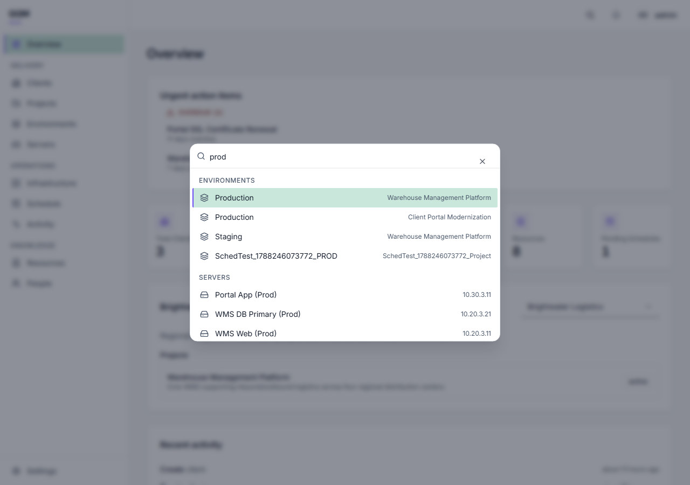

⌘K opens the palette focused on its input, groups server-ranked hits by entity,
moves selection with the arrow keys, navigates on Enter and closes on Escape.
The Topbar magnifier is verified as the second, discoverable entry point. The
resting prompt, the "Searching…" window and the no-results line (7.69:1) all
render as real states rather than an empty box.

### The three Sheets

All three share one shell, asserted per sheet: docked right, exactly 576px wide,
full viewport height, header and footer pinned with exactly one scroll region
between them — the whole reason Phase 7 moved these off centred modals.

| | |
|---|---|
| 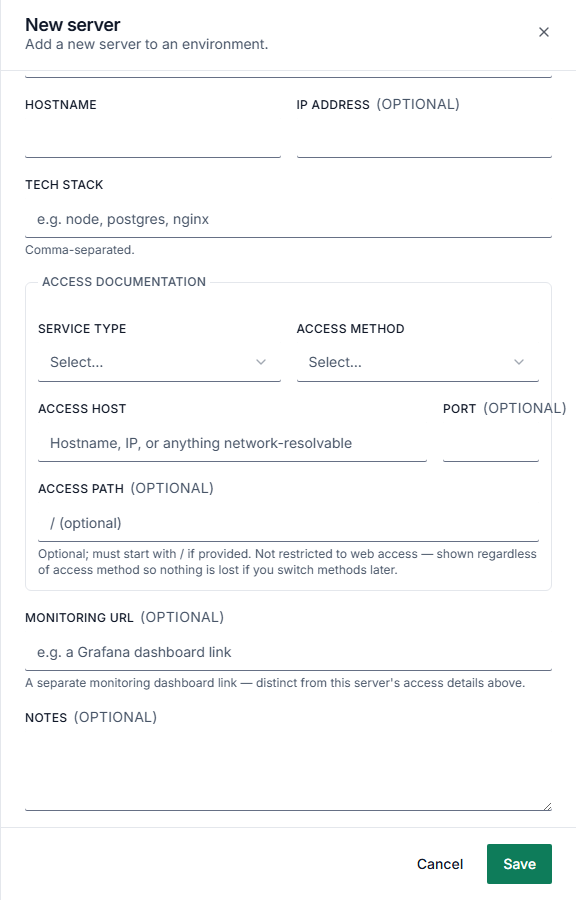 | 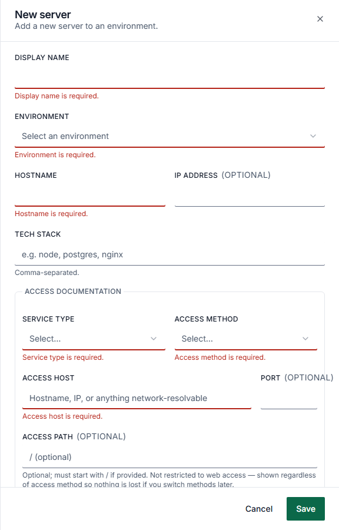 |
| **ServerFormSheet** — all 12 fields present; the Access documentation `<fieldset>` carries the shared `panelSurface()` treatment. | **Validation** — empty submit flags all six required fields, focus lands on the first invalid control in *render* order, and the control itself gets the danger underline (`inset 0 -2px`), not just red text. Field rules for port range, path prefix and URL all fire. Error text 6.57:1. |

| | |
|---|---|
| 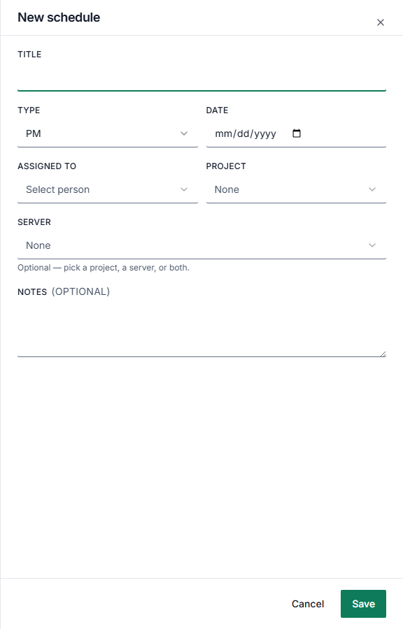 | 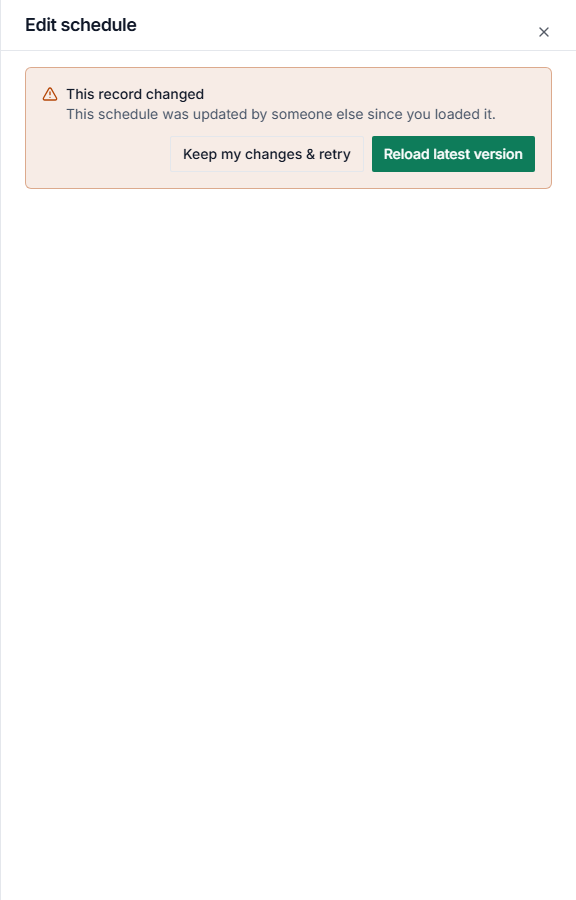 |
| **ScheduleFormSheet (create)** — empty submit flags title / date / assignee plus the cross-field "Project, Server, or both" rule that mirrors the backend CHECK constraint. In edit mode every field but `notes` is locked and the current status renders as a badge from the same four-colour vocabulary the list uses. | **ConflictState (409)** — forced via a route intercept, since the optimistic-lock branch is unreachable against a single client. The body *and* footer are replaced; only the header survives, so the sheet keeps its accessible name. Both actions ("Reload latest version" / "Keep my changes & retry") are present. |

| | |
|---|---|
| 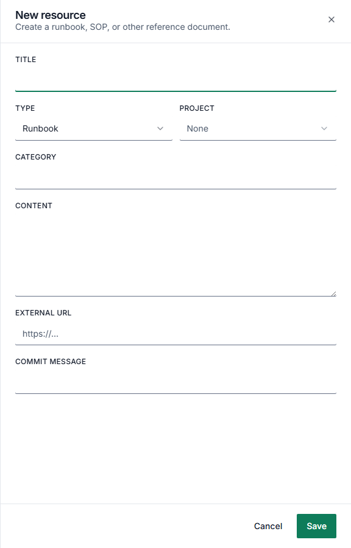 | 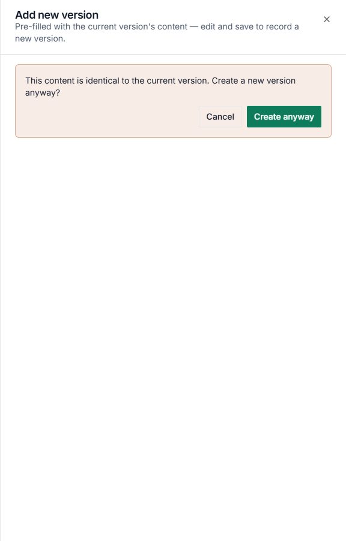 |
| **ResourceEditorSheet (create)** — empty submit flags title; new-version mode pre-fills from the current version and drops the Type select entirely (type is immutable). | **Duplicate-content confirmation** — saving byte-identical content raises the confirm panel, which replaces body and footer the same way the 409 branch does. Cancel returns to the form without committing. |

### Schedule status badges

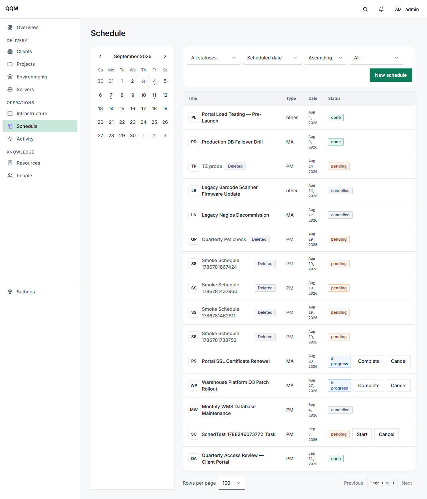

All four render their exact token values, and all four are mutually distinct:

| Status | Variant | Text | Tint | Border | Contrast |
|---|---|---|---|---|---|
| done | `success` | `rgb(8, 84, 60)` | `rgb(233, 245, 240)` | `rgb(127, 199, 172)` | 8.01:1 |
| in progress | `info` | `rgb(12, 79, 151)` | `rgb(240, 247, 255)` | `rgb(154, 193, 243)` | 7.54:1 |
| pending | `warning` | `rgb(147, 55, 13)` | `rgb(254, 246, 238)` | `rgb(245, 201, 155)` | 7.03:1 |
| cancelled | `neutral` | `rgb(52, 64, 84)` | `rgb(242, 244, 247)` | `rgb(208, 213, 221)` | 9.49:1 |

The status-transition control beside the badge stays at full opacity — it is a
workflow control, not a row action, and is never part of the idle dim.

### Tables and the deleted-row treatment

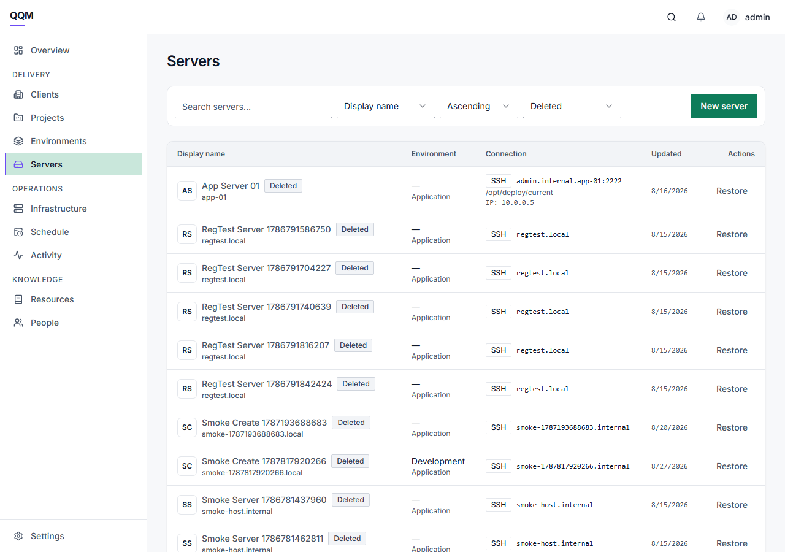

Across all six list pages: the table sits in `rounded-panel border border-border
bg-surface shadow-elev-1` with a sticky `thead`, the page never scrolls
sideways, and row actions idle at exactly `opacity: 0.6`, reaching full opacity
on both row hover *and* keyboard focus.

Deleted rows use the neutral badge (`rgb(52,64,84)` on `rgb(242,244,247)`,
9.49:1) plus `text-muted-foreground` cells — and the row's own opacity stays at
`1`, so **Restore**, a deleted row's only remaining action, is at full contrast.
This is the Phase 5 backlog closure, confirmed on all six modules.

### Detail pages

| | |
|---|---|
| 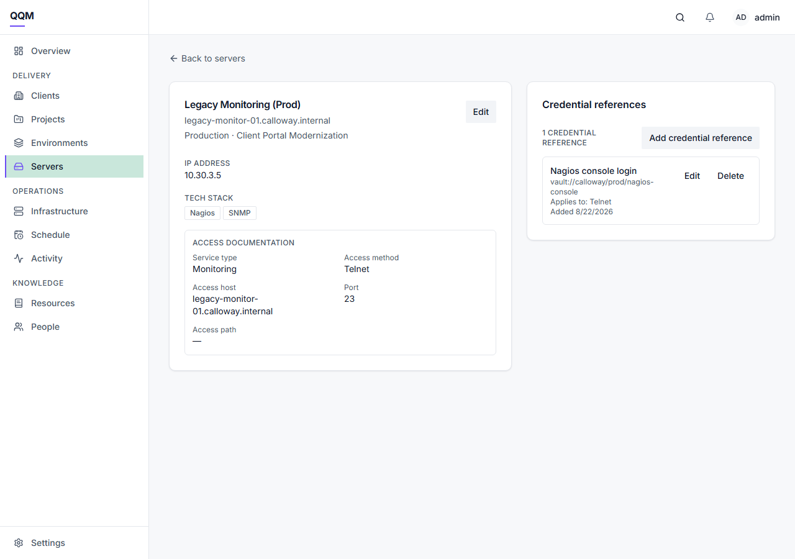 | 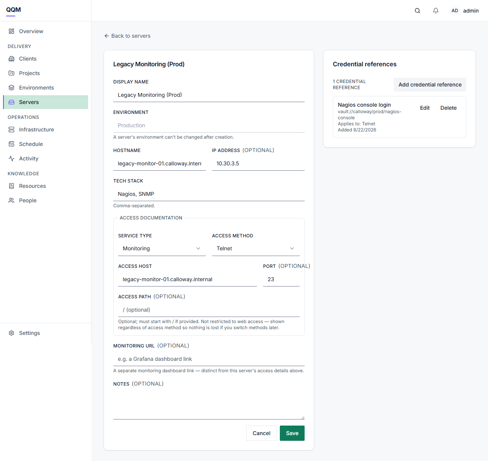 |

8.1b's heading fix holds: Project, Environment and Server detail each have
exactly one `<h1>` carrying the record name at `16px/600` (`text-heading-card`,
not a browser-default 2em), it is the first heading in the document, and no
heading level is skipped. **Environment and Server keep that `<h1>` in edit
mode** — the regression 8.1b fixed does not come back. Project edits through a
dialog, so its heading is never at risk.

8.1a's `panelSurface()` renders correctly at the detail-page sites: the Access
documentation panel keeps its `rounded-md border border-border` and holds its
two `<dl>` columns.

---

## Findings

Two real defects were found by this sweep. Both were recorded here first (each
pinned by a `test.fail()`-marked spec) and **both are now fixed** — see decision
#56 and the follow-up ticket 8.3a. Their guards have been promoted from
expected-failures to ordinary passing assertions, which is the proof the fixes
landed.

### 1. `Port` label overflowed the Access documentation panel — 2 sites ✅ fixed

The `Port` `OptionalLabel` laid out at 124.2px inside a `w-24` (96px) grid
track and spilled 15.2px past the panel's right border.

- **Cause:** `Label` is `inline-flex` with no wrapping — the box model 8.1a
  unified `Label` and `OptionalLabel` onto (commit `898e6ef`). "PORT" (33.7px)
  plus the `(optional)` span (84.5px) cannot break onto a second line, and the
  hardcoded 96px column predated that change.
- **Sites:** `ServerFormSheet.tsx` and `ServerEditCard.tsx`, which spelled the
  same `w-24` column.
- **Fix:** the fixed width is gone. The enclosing grid's second track is
  already `auto`, so the column now sizes to its own content — the label, since
  `Input` is `w-full`. Label and input both measure 124px and sit flush with
  the panel's inner right edge; Access host keeps 361px. A width that is
  *measured* rather than *guessed* cannot drift the same way again when label
  text or font metrics change.
- **Considered and rejected:** widening to `w-32` (128px) matched the app's
  only other fixed control width but cleared the label by just 3.8px — the same
  class of magic number that caused the defect. Wrapping the label would have
  left the Port input ~15px lower than Access host in the same grid row.
  Dropping `(optional)` would contradict decision #25's standing convention.
- **Guards, now ordinary assertions:** `phase-8-3-sheets.spec.ts` →
  *"ServerFormSheet: nothing inside the Access documentation panel overflows
  it"*; `phase-8-3-detail-pages.spec.ts` → *"Server detail (edit mode): nothing
  inside the Access documentation panel overflows it"*. Both also assert the
  label fits the column its input defines.

### 2. Clients' `Updated` column had no `tabular-nums` ✅ fixed

`ProjectsPage`, `ServersPage`, `EnvironmentsPage` and `ScheduleList` all render
their date cell as `font-mono text-xs text-muted-foreground tabular-nums`.
`ClientsPage` rendered a bare `toLocaleDateString()` in a plain
`text-muted-foreground` cell, so its dates did not column-align with the rest of
the app. (People has no date column at all, which is a different thing and not a
defect.)

- **Fix:** `ClientsPage`'s cell now uses the same shared pattern.
- **Guard:** `phase-8-3-tables-badges.spec.ts` → *"tabular-nums on the date
  column of every module that has one"*, whose `TABULAR_MODULES` set now
  includes `clients`.

### Scope notes (not defects)

- **There is no Client detail page.** `/clients/:id` is not a route
  (`AppRoutes.tsx`); the Clients list opens `ClientFormDialog` on row click.
  The ticket's group 5 lists "Client" among the detail pages — that surface
  does not exist, so the dialog is covered instead, and the sweep asserts the
  absence so a future `/clients/:id` trips the test rather than leaving a stale
  claim.
- **The sidebar has three labelled groups, not four.** `NAV_GROUPS` is
  Delivery / Operations / Knowledge; with the pinned Overview and the pinned
  Settings that is five sections, which is likely what "4 groups + Overview +
  pinned Settings" was counting.

### Pre-existing local-fixture drift (unrelated to the redesign)

Two older specs fail against the current local database. Neither is a visual
regression; both are hard-coded fixture expectations that the database has
drifted away from.

- `overview-metrics.spec.ts` asserts literal seed counts (2 / 2 / 5 / 8 / 8 / 2)
  and now reads 3 / 3 / 6 / 9 / 8 / 1. `create-flow-smoke.spec.ts` creates a
  real throwaway server and environment on **every** run, so these counts drift
  by design. Worth decoupling in a follow-up (assert relative change, or clean
  up the smoke records).
- `375px-sweep.spec.ts` looks for a person named
  `Krzysztofferpendragonwickramasinghebalasubramaniam`. Eight such rows exist
  but **all are soft-deleted**, and the spec searches with the default
  `deleted=false` filter.

---

## Sign-off checklist

- [x] All 5 scope groups covered by Playwright visual-sweep specs with passing
      DOM/layout assertions — 62 tests, all green.
- [x] Screenshots exported as evidence; the highlighted subset committed and
      embedded above.
- [x] No unexpected visual regressions in the Phase 5–7 redesign.
- [x] Two real defects found, both cosmetic — recorded with guard specs during
      8.3, then fixed in 8.3a. Both guards now pass as ordinary assertions
      rather than expected-failures.
- [ ] **Hello's sign-off.**
